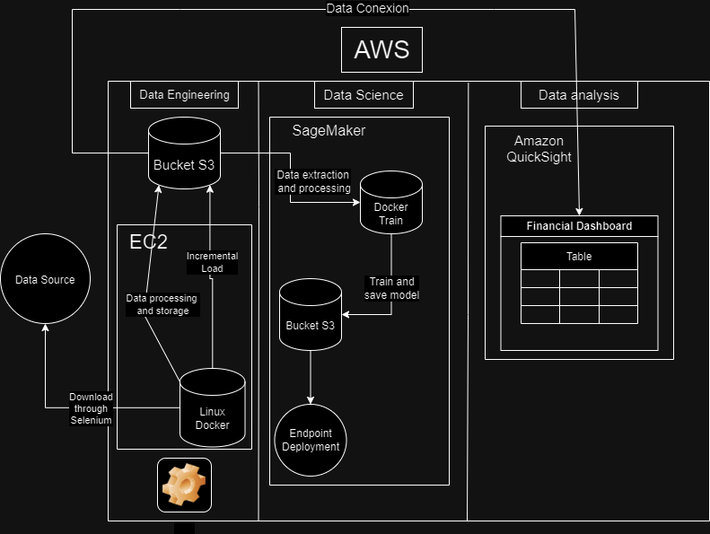
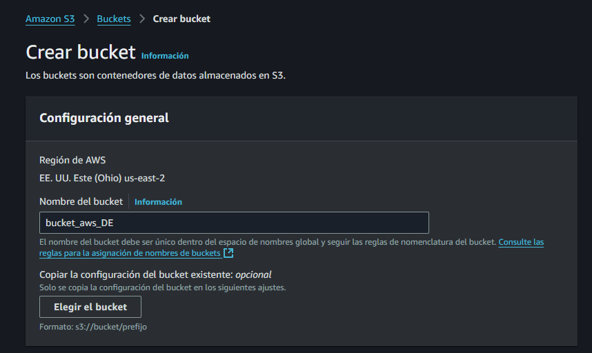
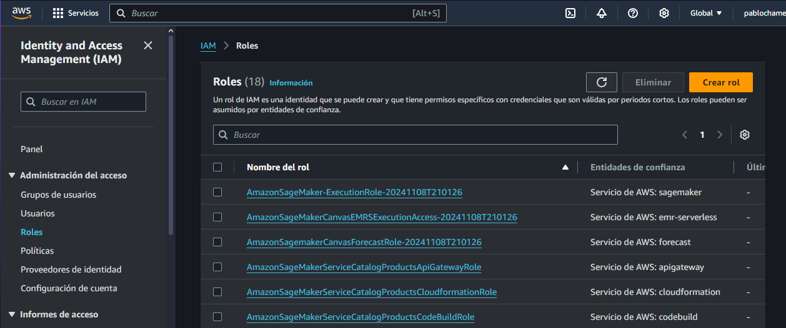
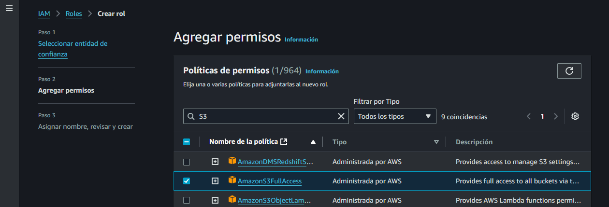
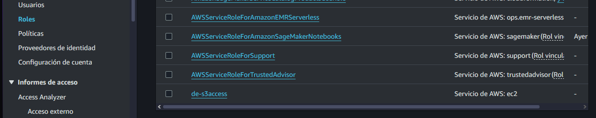

# Guia del proyecto.


| Tarea                             | Descripción                                                                                   | Herramientas                        |
|-----------------------------------|-----------------------------------------------------------------------------------------------|-------------------------------------|
| Crear cuenta AWS gratuita          | Registrarse en AWS y activar los servicios necesarios.                                       | Consola de gestión de AWS          |
| Crear un bucket S3                | Almacenar los datos del proyecto.                                                             | Consola de gestión de AWS          |
| Crear una instancia EC2           | Entorno de desarrollo para el preprocesamiento de datos y el modelado.                      | Consola de gestión de AWS, Jupyter Notebook |
| Cargar datos a S3                 | Transferir los datos desde tu máquina local a S3.                                           | AWS CLI, S3 console                |
| Preprocesar datos                 | Limpiar y transformar los datos utilizando Python.                                           | Pandas, NumPy                      |
| Entrenar un modelo en SageMaker   | Crear un notebook de SageMaker, elegir un algoritmo y entrenar el modelo.                   | SageMaker Studio, Python           |
| Implementar el modelo como un endpoint | Desplegar el modelo entrenado como un endpoint para realizar predicciones.                | SageMaker console                   |
| Crear un dashboard en QuickSight   | Visualizar los resultados del modelo.                                                         | QuickSight console                  |


# Flujo del proyecto




# Step by Step

### Bucket creation

Un bucket es un contenedor de objetos en Amazon Simple Storage Service (S3), un servicio de almacenamiento en la nube escalable y duradero.

Características de los buckets:

- Nombre único: Cada bucket debe tener un nombre único a nivel global en AWS.
- Capacidad prácticamente ilimitada: Puedes almacenar una cantidad masiva de datos en un bucket.
- Alta durabilidad: Amazon S3 replica tus datos en múltiples ubicaciones para garantizar su durabilidad.
- Acceso rápido: Puedes acceder a tus datos desde cualquier lugar del mundo con una latencia baja.
- Seguridad: Amazon S3 ofrece una amplia gama de características de seguridad, como cifrado de datos en reposo y en tránsito, control de acceso basado en políticas y autenticación multifactor.





- Propiedad de objetos: ACL deshabilitadas
- Bloquear todo el acceso público: hacer privado nuestro bucket.

### Puntos clave al utilizar buckets en Amazon S3:
- Nombre: Debe ser único a nivel global y descriptivo.
- Ubicación: Elige la región más cercana a tus usuarios para minimizar la latencia.
- Permisos: Define quién puede acceder y qué acciones puede realizar.
- Versionado: Activa el versionado para guardar múltiples versiones de un archivo.
- Cifrado: Utiliza el cifrado para proteger tus datos.
- Ciclo de vida: Configura reglas para gestionar el ciclo de vida de los objetos.
- Costos: Comprende la estructura de costos y optimiza el uso.
- Acceso público: Evita el acceso público a menos que sea necesario.
- Cumplimiento: Asegúrate de cumplir con las regulaciones aplicables.

# IAM Role

Pasos:



- Crear un nuevo rol
- Asignar el servicio de AWS y caso de uso para S3.



- Se asigna el nombre del rol: "de-s3access"



**Pasos para crear un rol de IAM y permitir acceso a un bucket S3 desde una instancia EC2:**

1. **Crea un rol de IAM:**
   * En la consola de IAM, crea un nuevo rol.
   * Selecciona "AWS service" como entidad confiable.
   * Elige "EC2" como servicio.
   * Asigna una política:
     * **AmazonS3ReadOnlyAccess:** Solo lectura en S3.
     * **AmazonS3FullAccess:** Lectura y escritura en S3.
     * **Política personalizada:** Define permisos específicos (ej: acceso a un bucket concreto).

2. **Asociar el rol a la instancia EC2:**
   * Ve a EC2 y selecciona la instancia.
   * En "Descripción", asocia el rol recién creado.

3. **Verificar acceso:**
   * Conéctate a la instancia vía SSH.
   * Utiliza la AWS CLI para listar los objetos en el bucket:
     ```bash
     aws s3 ls s3://nombre-del-bucket
     ```

**Ejemplo de política personalizada (solo lectura a un bucket):**

```json
{
  "Version": "2012-10-17",
  "Statement": [
    {
      "Effect": "Allow",
      "Action": "s3:GetObject",
      "Resource": "arn:aws:s3:::nombre-del-bucket/*"
    }
  ]
}
```


